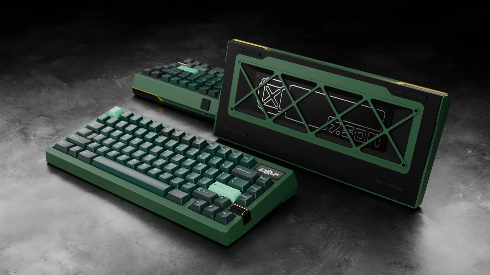
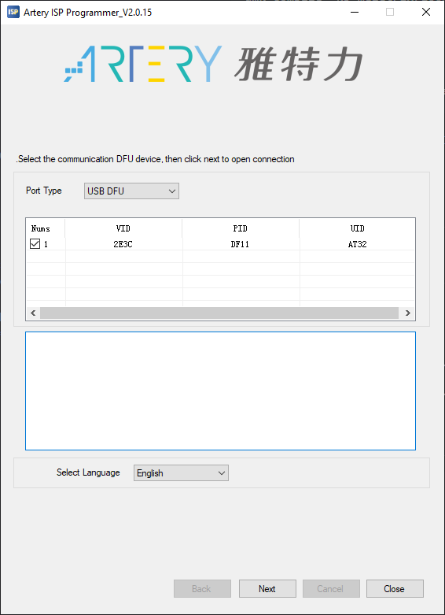
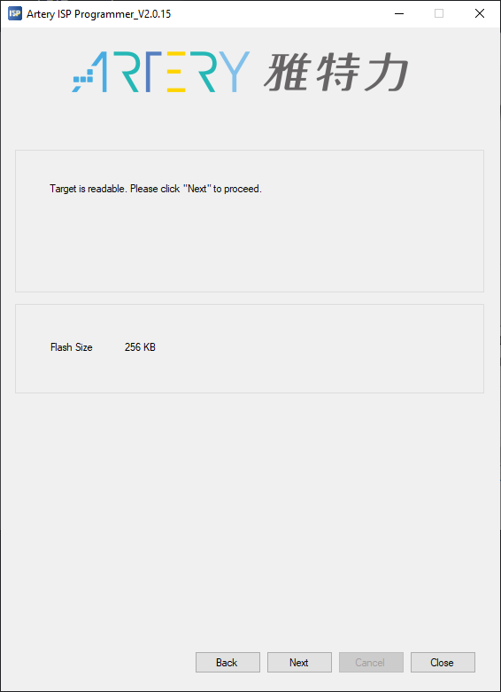
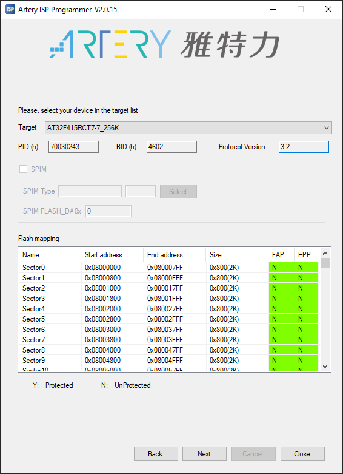
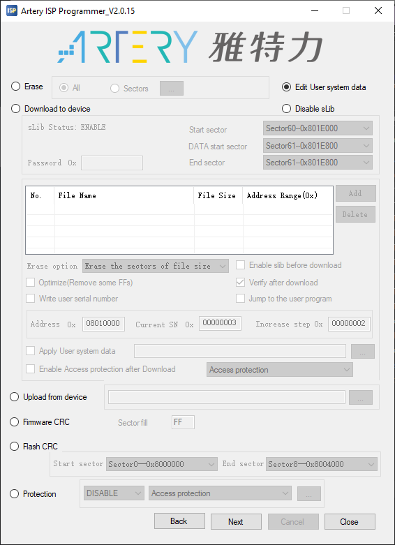
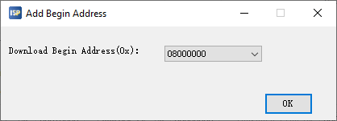
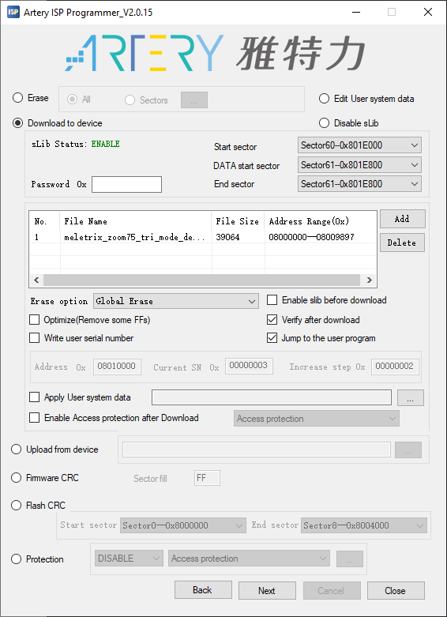
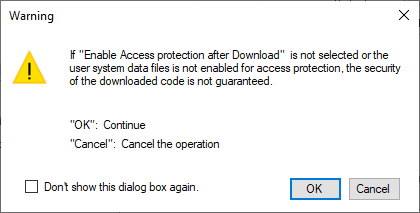
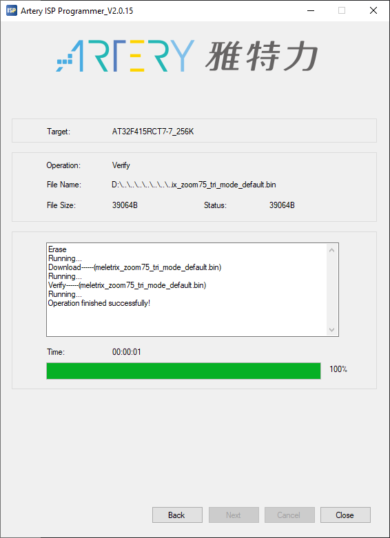

# meletrix/zoom75_tiga/tri_mode

<!--  -->
<!--  -->

The goal of this project is to create highly-customisable open-source firmware for the wireless variant of the Zoom75 Tiga. This is done by predefining a lot of defaults, allowing users to have less knowledge about QMK to change default values. Another goal of this project is to extend the out-of-the-box functionality of the keyboard.

* Keyboard Maintainer: [Mark Hooijberg](https://github.com/MHooijberg)
* Hardware Supported: WQ206B1UBTG2-81KEY V1.0
* Hardware Availability: [Official Website Store Page](https://meletrix.com/collections/zoom75-tiga)

QMK CLI example for this keyboard (after setting up your build environment):

    qmk compile -kb meletrix/zoom75/tri_mode -km default

Make example for this keyboard (after setting up your build environment):

    make meletrix/zoom75_tiga/tri_mode:default

Flashing example for this keyboard:

    make meletrix/zoom75_tiga/tri_mode:default:flash

See the [build environment setup](https://docs.qmk.fm/#/getting_started_build_tools) and the [make instructions](https://docs.qmk.fm/#/getting_started_make_guide) for more information. Brand new to QMK? Start with our [Complete Newbs Guide](https://docs.qmk.fm/#/newbs).

## Features
The firmware aims to add more customization ontop of the stock firmware. To achieve this the firmware should have all features of the stock firmware with additions of QMK functionality, and eventually, custom functionality. Below is a list of features the latest version of the firmware supports.

- [X] Detected as a USB device.
- [ ] Feature support: External EEPROM storage.
- [ ] Feature support: Extra RGB animations.
- [X] Feature support: Full QMK Support and (most) features.
- [ ] Feature support: Full wireless functions, and additions (extra profiles etc.).
- [ ] Feature support: Implement stock custom keycodes.
- [ ] Feature support: Working RGB Matrix.
- [ ] Keymap support: Default - MacOS layout.
- [X] Layout support: ANSI.
- [X] Layout support: Backspace - Split.
- [X] Layout support: ISO.
- [X] Layout support: Left Shift - Split.
- [X] Layout support: Spacebar - 6.25U .
- [X] Layout support: Spacebar - 7U.
- [X] Layout support: Spacebar - Split.
- [X] Module support: Badge.
- [X] Module support: Knob.
- [X] Module support: LCD.
- [X] Program support: [VIA](https://www.caniusevia.com/) support.
- [ ] Program support: [VIAL](https://get.vial.today/) support.
- [ ] Program support: [Zoom-Sync](https://github.com/ozboar/zoom-sync) support.
- [ ] Program support: Pocket Wuque support.
- [ ] Remember last state (RGB, LCD, etc.).

## Flashing
As of the moment, the at32-dfu flashing program is not fully implemented in QMK. To work around this the official ISP [Programmer](https://www.arterychip.com/en/product/AT32F415.jsp) from Artery can be used.

**DISCLAIMER: This program is incredibly powerful and can brick your keyboard if used incorrectly. Before using any other option than what is indicated in this guide, make sure you know what you're doing. A detailed guide can be found between the download files with the previous provided link. Or can be found between the installed files of the program.**

### 1. Get or compile the firmware
First get the precompiled firmware or compile the firmware yourself from source.

### 2. Get the board in DFU mode
Before new firmware can be flashed to the keyboard has to be put into 'dfu' mode. Open the Artery ISP Programmer, select 'USB DFU' under 'port type', then put it into DFU mode (this can be done in multiple ways described in the 'bootloader' section of this README.md).

If the keyboard is in DFU mode, it should be added to the list, and be shown with VID number `2E3C` and PID number `DF11`. Ensure this is the only selected device, and do not have multiple keyboards in DFU mode attached at once.

The flash status page (next page) shows some information about the flash size. This page can be look at, afterwards, continue to the next page.

The device information page displays device-related information such as target device, PID, BID, protocol version, Flash mapping and Flash protection status, it should display the AT32F415RCT7-7 MCU that's used inside the Zoom75 Tiga. Ensure the page looks similar to the picture below, and continue to the next page.

**Attention, the operation configuration page is complex and wrong settings here could brick your MCU as you could enable write protection or erase important data, closely follow the following steps:**

The first time you load this page it should look like the image below:

First select 'Download to device', to set the operation to flash firmware to the MCU, next add the firmware **meletrix_zoom75_tiga_tri_mode_*.bin** file by clicking on add and selecting it (Note: the .hex file can be used but is not tested so it is **not recommend**). After you select it it will ask for the 'Download Begin Address (0x)'. This is the memory address where the firmware will start, and should be set to 0x08000000, the dialog will display '08000000'. In the case that there's a file already in the list, delete it first and then add it again to ensure its the latest file.

The 'Password 0x' option should be empty, 'Start sector', 'Data start sector', and 'End sector' can be left as is. Next the 'Erase option' should be set to 'Global Erase'. And only the boxes 'Verify after download' and 'Jump to the user program' should be checked. After filling in the settings the page should look similar to the picture below:

After clicking 'Next' a dialog will pop up, saying that if no protection is enabled the security of the downloaded code cannot be guaranteed, as we would like the ability to flash new firmware to the MCU in the future, this message can 'safely' be ignored.

**Note: The moment 'ok' is clicked, it will perform the specified operation, if you're not sure of the settings you've specified, this is the last chance to cancel.**

After flashing the new firmware a device disconnect sound might sound, this is normal. The operation progress page should show the current status of the operation and if the operation finished successfully. After a successful flash the screen should look similar to the following:

The flashing is a success and the program can be closed.

### 3. Setting up VIA (Optional)
After flashing new firmware to the device VIA can setup to allow for easy configuration of the keyboard, such as switching from ANSI to an ISO layout.

To do this download and install VIA. After the installation is completed, the configuration of the board needs to be loaded for VIA to recognize the board (Note: this step is temporarily untill we can add the via.json into the upstream VIA repository that the program uses to automatically detect keyboards.).

To load the configuration file go to the `SETTINGS` tab and turn on the `Show Design Tab` setting. Next go to the `DESIGN` tab and click on the option next to `Load Draft Definition`, select the VIA.json file that corresponds with the firmware (Stock vs. Custom). After selecting the file go back to the `CONFIGURE` tab to authorize VIA to read information from your keyboard.

From here you can setup the keyboard layout in the design tab or specify a custom keymap.

Happy typing!

## Bootloader
Enter the bootloader in 3 ways:
* **Bootmagic reset**: Hold down the key at (0,0) in the matrix (usually Escape, or top left button) and plug in the keyboard
* **Default firmware**: The default firmware can be put in DFU mode by using the 'switch to DFU' in the official flashing program provided by Meletrix.
* **Keycode in layout**: Press the key mapped to `QK_BOOT` if it is available
* **Physical reset button**: Hold the reset-button on the back of the PCB while plugging in the USB cable.

## Credits
The process of creating custom firmware for the Zoom75 Tri-Mode PCB was a huge effort, therefore the following section is to give credits to the amazing people who helped, provided information, feedback, and new insights.

- alaudbrother (Discord)
- B4zookaw (Discord)
- Drashna (Discord, [GitHub](https://github.com/drashna))
- Horrortroll (Discord, [GitHub](https://github.com/HorrorTroll/))
- matthijsboog (Discord, [GitHub](https://github.com/MattBoog))
- Ozwaldorf (Discord: ozwaldorf, [GitHub](https://github.com/ozwaldorf))
- SigProf (Discord, [GitHub](https://github.com/sigprof))

Also a huge thanks to anyone else who supported the project, if your name is not on the list while it should be, send us a message.

# TODO: Add LCD support
# TODO: Test RGB matrix
# TODO: See if the via.json can be included in via's repository for automatic detection.
# TODO: Add and test RGB sleep support.
# TODO: Add and test LCD sleep support.
# TODO: Update ReadMe.md (pictures, text and credits)
# TODO: Create support for extra (currently empty) flash memory chip slot.
# TODO: Create enhanced version of default keymap.
# TODO: Only basic features for default keymap, while including all features for enhanced version.
# TODO: Make alias for all custom keycodes.
# TODO: Fix the via.json wording, sort all values including layout options.
